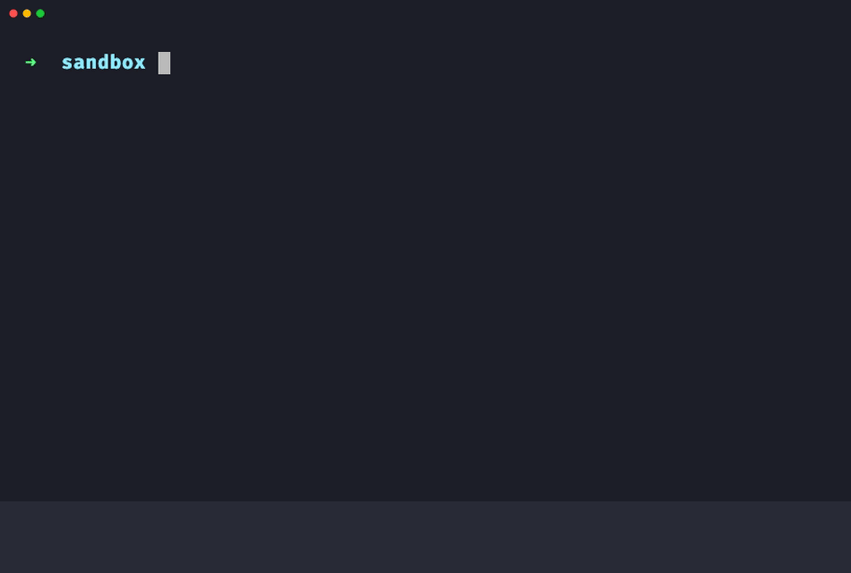

# Better Shell

Time travel your terminal from 1969 to modernity with a single command.

```bash
curl -fsSL https://shell.ocodista.com/install.sh | bash
```

Auto-completions, history search, jumps (z), syntax-highlighting and much more.

## Demo



## Install

### macOS and Linux

```bash
curl -fsSL https://shell.ocodista.com/install.sh | bash
```

### Windows PowerShell

```powershell
irm https://shell.ocodista.com/install.ps1 | iex
```

## What you get

- zsh with Oh My Zsh and useful plugins
- Tab completions and syntax highlighting
- Fuzzy history search with `Ctrl+R`
- Fast directory jumps with `z`
- A modern `ls` with icons through `eza`
- tmux with sensible defaults
- Node.js LTS through `mise`
- FiraCode Nerd Font

## Usage

```bash
better-shell check                  # Check installed tools
better-shell install --minimal      # Skip optional extras
better-shell install --no-tmux      # Skip one feature
better-shell install --interactive  # Customize the install
```

After installation:

1. Restart the terminal or run `exec zsh`.
2. In tmux, press `Ctrl+B`, then `I`, to install plugins.
3. Set your terminal font to **FiraCode Nerd Font**.

## Troubleshooting

If zsh is not your default shell, run:

```bash
chsh -s $(command -v zsh)
```

## License

MIT
